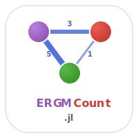

# ERGMCount.jl


[](https://github.com/statistical-network-analysis-with-Julia/ERGMCount.jl)
[](https://github.com/statistical-network-analysis-with-Julia/ERGMCount.jl/actions/workflows/CI.yml?query=branch%3Amain)
[](https://statistical-network-analysis-with-Julia.github.io/ERGMCount.jl/stable/)
[](https://statistical-network-analysis-with-Julia.github.io/ERGMCount.jl/dev/)
[](https://julialang.org/)
[](https://opensource.org/licenses/MIT)

<p align="center">
  
</p>

ERGMs for Count-Valued Networks in Julia.

## Overview

ERGMCount.jl extends ERGM to handle networks with integer-valued edge weights, using Poisson, geometric, or binomial reference measures. This allows modeling of networks where ties have counts or intensities rather than just presence/absence.

This package is a Julia port of the R `ergm.count` package from the StatNet collection.

## Installation

Requires Julia 1.12+. ERGMCount.jl depends on the unregistered
[Networks.jl](https://github.com/statistical-network-analysis-with-Julia/Networks.jl) and [ERGM.jl](https://github.com/statistical-network-analysis-with-Julia/ERGM.jl) packages, which must be added first (in this order):

```julia
using Pkg
Pkg.add(url="https://github.com/statistical-network-analysis-with-Julia/Networks.jl")
Pkg.add(url="https://github.com/statistical-network-analysis-with-Julia/ERGM.jl")
Pkg.add(url="https://github.com/statistical-network-analysis-with-Julia/ERGMCount.jl")
```

For development, you can instead clone all ecosystem repositories side by
side (the monorepo layout) and start Julia with the root workspace project
(`julia --project=.` in the clone root): the `[sources]` path dependencies
then wire the packages together with no ordered installs needed.

## Features

- **Reference measures**: Poisson, Geometric, Binomial, Discrete Uniform
- **Count-specific terms**: Sum, Nonzero, Mutual, Transitive ties
- **Estimation**: MPLE for count-valued ERGMs
- **Simulation**: Gibbs sampling for count networks

## Quick Start

```julia
using Networks
using ERGMCount

# Network with edge weights
net = network(20)
# ... add edges with weights ...

# Define terms
terms = [
    SumTerm(),        # Total edge weight
    NonzeroTerm(),    # Number of non-zero edges
    CountMutualTerm() # Weighted mutuality
]

# Fit with Poisson reference
result = ergm_count(net, terms; reference=PoissonReference(1.0))
```

`fit_ergm_count` is the standardized entry point (the ecosystem's
`fit_<model>` naming); `ergm_count` is the R-faithful alias of the same
function, and `fit_count_ergm` is kept for backward compatibility.

## Reference Measures

The reference measure `h(y)` determines the baseline distribution for edge values.

```julia
# Poisson: good for unbounded counts
# h(y) ∝ λ^y / y!
PoissonReference(1.0)   # λ = 1.0

# Geometric: for counts with high variance
# h(y) ∝ (1-p)^y
GeometricReference()   # counting measure h(y)=1; shape comes from a negative Sum coefficient

# Binomial: for bounded counts (0 to n)
# h(y) = C(n,y) p^y (1-p)^(n-y)
BinomialReference(10)  # h(y) = C(10, y); bounded counts

# Discrete Uniform: equal probability for 0:max
DiscUnifReference(10)      # equal probability on 0:10

# Discrete Uniform on range a:b
DiscUnif2Reference(1, 10)  # equal probability on 1:10
```

## Count-Specific Terms

### Basic Terms
```julia
SumTerm()            # Σ y_ij (total edge weight)
NonzeroTerm()        # Σ I(y_ij > 0) (edge count)
GreaterthannTerm(2)  # Σ I(y_ij > n), here n = 2
CountAtleastnTerm(3) # Σ I(y_ij >= n), here n = 3
```

### Structural Terms
```julia
CountMutualTerm()      # Σ min(y_ij, y_ji)
TransitiveTiesTerm()   # Weighted transitivity
CyclicalTiesTerm()     # Weighted cyclicality
```

### Degree Terms
```julia
NodeOSumTerm()   # Out-strength heterogeneity
NodeISumTerm()   # In-strength heterogeneity
NodeSumTerm()    # Total strength heterogeneity
```

## Model Fitting

```julia
# Fit count ERGM
result = ergm_count(net, terms;
    reference=PoissonReference(1.0),
    method=:mple
)

# View results
println(result)
```

## Simulation

```julia
# Simulate from fitted model
sim_nets = simulate_count_ergm(result;
    n_sim=100,
    burnin=1000,
    max_val=20  # Maximum edge value to consider
)
```

## Example: Communication Frequency

```julia
# Email counts between employees
# y_ij = number of emails from i to j

terms = [
    SumTerm(),              # Overall activity
    NonzeroTerm(),          # Network density
    CountMutualTerm(),      # Reciprocity in frequency
    NodeOSumTerm(),         # Sender activity variance
]

# Poisson reference assumes emails arrive as Poisson process
result = ergm_count(net, terms; reference=PoissonReference())
```

## Mathematical Background

Count ERGM has the form:

```
P(Y = y) ∝ h(y) exp(θ'g(y))
```

Where `h(y) = Π_ij h(y_ij)` is the reference measure.

For Poisson reference with SumTerm:
- Positive coefficient → higher edge values more likely
- The coefficient shifts the mean of the Poisson

## Documentation

For more detailed documentation, see:

- [Stable Documentation](https://statistical-network-analysis-with-Julia.github.io/ERGMCount.jl/stable/)
- [Development Documentation](https://statistical-network-analysis-with-Julia.github.io/ERGMCount.jl/dev/)

## References

1. Krivitsky, P.N. (2012). Exponential-family random graph models for valued networks. *Electronic Journal of Statistics*, 6, 1100-1128.

2. Desmarais, B.A., Cranmer, S.J. (2012). Statistical mechanics of networks: Estimation and uncertainty. *Physica A*, 391(4), 1865-1876.

3. Hunter, D.R., Handcock, M.S., Butts, C.T., Goodreau, S.M., Morris, M. (2008). ergm: A package to fit, simulate and diagnose exponential-family models for networks. *Journal of Statistical Software*, 24(3), 1-29.

## License

MIT License - see [LICENSE](LICENSE) for details.
